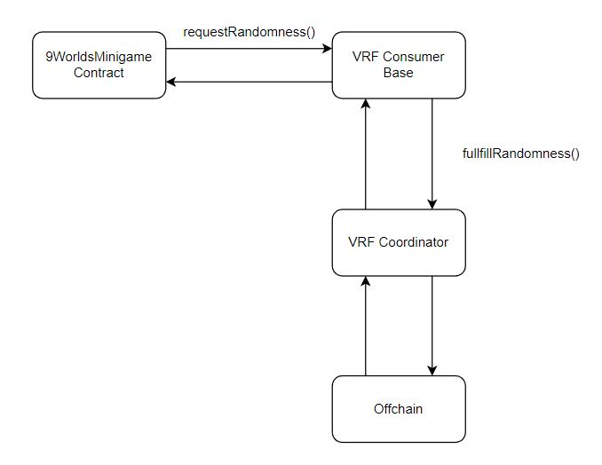

# 9Worlds Minigame: Erlog

## Introduction

Earlog contracts manage all things related with matches, points Nfts are selected randomly using Chainlink VRF service, ensuring that Earlog abides by all regulatory requirements.

### Folder structure

```
com.geodb.9worlds.card.minigae,contracts/     # Root directory.
|- contracts/           # Folder used to store contract files.
|- coverage/            # Coverage tests results.
|- test/                # Truffle test files.
|- flat/                # Contract flattened.
|- package.json         # Project dependencies.
|- truffle-config.js    # Truffle configuration.
```

## How does it work

- Chainlink has two main contracts for randomness: `VRFConsumerBase.sol` and `VRFCoordinator.sol`.
- For this project we are using two functions:
    - `requestRandomness`: initial request for random number.
    - `fullfillRandomness`: callback function that is executed after random number is generated.



- `9WorldsMinigame` contract will inherit the `VRFConsumerBase` contract and will call the `requestRandomness` function within the `VRFConsumerBase.`

- The request to randomness starts and the `VRFConsumerBase` calls the `VRFCoordinator` contract which is reponsible for getting the randomness back from the offchain.

- After the `VRFCoordinator` has the randomness it calls the `fullFillRandomness` function within the `VRFConsumerBase` which selects the random nfts for the match.

## Prerequisites

To be able to play the game you need to have at least 1 or more Midgard weapon collention NFTs. To obtain them you may go to: https://opensea.io/collection/o9wmidgard

## How to test

In order to test contracts a local network based on Polygon should be deployed.


### Step 1. Clone repository

```
git clone https://github.com/GeoDB-Limited/com.geodb.9worlds.card.minigame.contracts.git
```

### Step 2. Install dependencies

```
npm install
```

### Step 3. Deploy ganache and fork polygon network

```
npm run ganache:polygon
```

### Step 4. Use truffle test

```
truffle test --network development
```

### Step 5. Use truffle coverage (optional)

```
truffle run coverage --network development
```